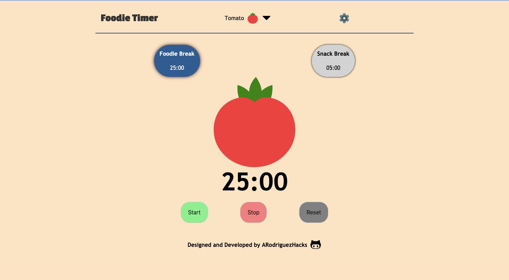
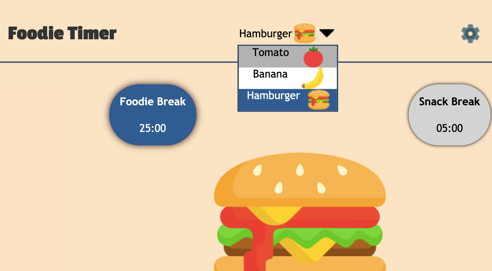

# Foodie Timer

A simple pomodoro clone with a fun foodie theme.

With working start, stop and reset buttons, users can use this app to set a timer for whatever their work needs are.

## Features

### Timer Settings

The app has two timer settings: "Foodie Timer" and "Snack Timer". The former is meant to set a longer period of time, but both options are easy to customize by opening the settings menu via the settings icon.

### Dropdown Food Menu

Users can change the center image with the dropdown section in the middle of the navigation menu.

Currently on the menu are:

- Tomato
- Banana
- Hamburger

## Technologies Used:

- HTML
- CSS / Flexbox
- JavaScript (no frameworks)
- DOM manipulation
- ES6 modules

Additional features are still in the works, including a sound notification when timer stops and interactivity with the center image.
